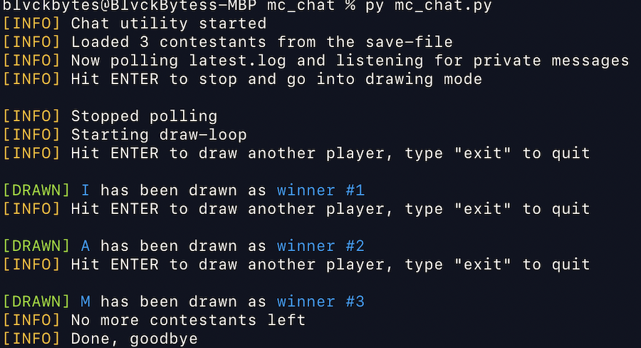

# mc_chatio

A small convenience-tool to interface with the chat of a minecraft instance without any direct hooks while supporting both reading and writing.

WARNING: This only works on macOS, since there are specific apple-script as well as keyboard-event calls.

## I/O

The tool opens the latest.log file in read-only mode and polls for new lines (inspired by tail -f). Those lines are then fed to an event-handler, where you can respond to the message. To write into the chat, there's a routine which will focus the window and take care of all keystrokes.

## example operation

It's currently programmed to wait for incoming private messages (/msg), identified by a regex format, which then adds all users to a unique list of usernames. This way, players can parttake the giveaway. After quitting this mode, the draw loop will be entered, which randomly draws players from this loop (as winners of a giveaway in this case).

When another winner is found, the tool automatically focuses the minecraft window, closes the ESC overlay, opens the chat and dispatches a broadcast message as well as the actual command to hand over the won price (/pay). Then, the focus is resumed on the terminal, where another enter key-press will cause yet another draw, until no more contestants are left.

Contestants are persistently saved in a .txt file next to the source files, in case of a crash. That file is kept in sync with the list in RAM at all time. This operation allows for quick, fair and easy giveaways on foreign servers where no plugins can be loaded.